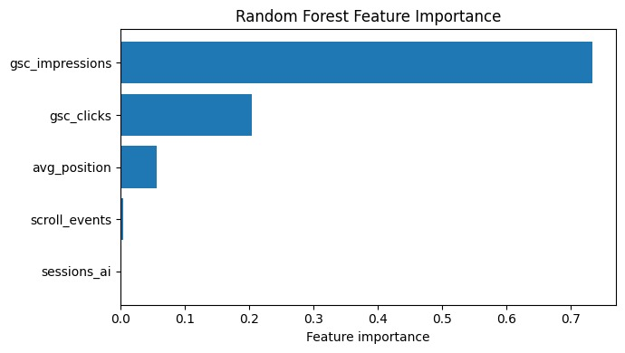
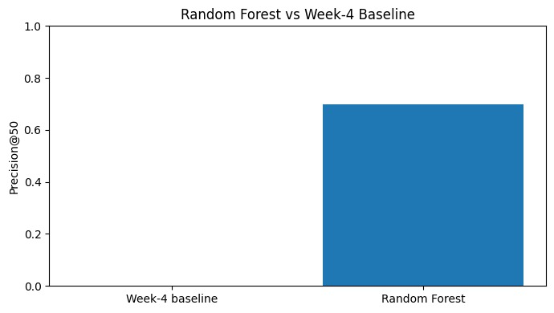

<!DOCTYPE html>
<html lang="en">
<head>
    <meta charset="UTF-8">
    <meta name="viewport" content="width=device-width, initial-scale=1.0">

    <title>Ranking Content Pages for Engagement Opportunity Investigation</title>

    
</head>

<body>

<header>
    

        
FlyRank ML Internship Capstone

        <h1>
            Ranking Content Pages for Engagement Opportunity Investigation
        </h1>

        

            Using search and engagement signals to prioritize content pages
            for human investigation and possible improvement.
        

    

</header>

<main class="container">

    <!-- 1. TITLE + ABSTRACT -->
    <section id="abstract">
        <h2>1. Title + Abstract</h2>

        

            

                This study asks which content pages a website manager should
                investigate first when they show potential engagement problems.
                Using the FlyRank ML Internship warehouse release, the analysis
                focuses on 9,841,378 daily content-performance observations
                from March 2026, covering 55 clients and 331,437 content pages.
                A Random Forest model was used to rank pages from observed search
                and engagement signals, with validation performed using a
                client-grouped split and Precision@50 as the primary ranking
                metric. The Random Forest achieved a Precision@50 of 0.70
                compared with 0.00 for the Week-4 rule-based baseline on the
                same held-out test set. The resulting ranking is intended as
                decision support that helps website managers prioritize pages
                for investigation and possible improvement rather than
                automatically determining what changes should be made.
            

        

    </section>

    <!-- 2. INTRODUCTION -->
    <section id="introduction">
        <h2>2. Introduction / Problem Statement</h2>

        

            Website managers may have a large number of content pages competing
            for limited review time. The practical question is therefore not
            simply whether a page has an engagement problem, but which pages
            should be investigated first.
        

        

            This capstone addresses the following research question:
        

        

            <strong>
                Which content pages should a website manager investigate first
                when they show potential engagement problems?
            </strong>
        

        

            The decision supported by this analysis is the prioritization of
            pages for investigation and possible improvement.
        

        

            The output is a ranked list of content pages based on an
            engagement-opportunity score. A human website manager can use this
            ranking to decide where to begin investigation, while retaining
            responsibility for diagnosing the cause of a problem and choosing
            an appropriate action.
        

        

            Machine learning is useful here because multiple observed search
            and engagement signals may interact in ways that are difficult to
            capture with a single hand-written rule. The model therefore
            provides a systematic way to combine these signals into a
            prioritization score.
        

        

            The cost of a wrong call is also important. A page ranked too highly
            may receive unnecessary review effort, while a page ranked too low
            may have a potential engagement issue overlooked. For this reason,
            the model is framed as decision support, not as an automatic
            content-change system.
        

    </section>

    <!-- 3. DATA -->
    <section id="data">
        <h2>3. Data</h2>

        

            This analysis uses the public-safe FlyRank ML Internship warehouse
            release hosted on Hugging Face. The analysis uses the
            <strong>fact_content_daily_performance</strong> table and focuses
            on the March 2026 development window.
        

        

            

                <strong>9,841,378</strong>
                March daily observations
            

            

                <strong>55</strong>
                clients
            

            

                <strong>331,437</strong>
                content pages
            

            

                <strong>March 2026</strong>
                development window
            

        

        

            The March 2026 data covers dates from March 1, 2026 through
            March 31, 2026. For modeling, the daily observations were
            aggregated to one row per client and content page.
        

        <h3>Modeling signals</h3>

        <ul>
            <li>gsc_impressions</li>
            <li>gsc_clicks</li>
            <li>avg_position</li>
            <li>sessions_ai</li>
            <li>scroll_events</li>
        </ul>

        

            The analysis deliberately excludes future-month performance so
            that information from periods after the development window does
            not influence the ranking.
        

        

            Client and content identifiers are pseudonymous. They are retained
            only where needed for grouping, evaluation, and traceability and
            are not used as predictive features.
        

        

            The public-facing work does not expose client names, domains,
            URLs, private queries, credentials, or raw data exports.
        

        

            Data-availability fields were also excluded as predictive signals
            because they describe whether data exists rather than representing
            the engagement behavior that the model is intended to rank.
        

        

            The March 2026 development window was selected based on the earlier
            data-contract and baseline work. The analysis is therefore scoped
            to the observed March 2026 data rather than making claims about all
            future periods.
        

    </section>

    <!-- 4. METHODOLOGY -->
    <section id="methodology">
        <h2>4. Methodology</h2>

        

            This analysis treats engagement opportunity as a ranking problem
            rather than a classification problem. The objective is to produce
            an opportunity score that helps prioritize pages for human
            investigation.
        

        <h3>Model</h3>

        

            A Random Forest was selected because it can capture nonlinear
            relationships and interactions among multiple observed search and
            engagement signals. The model produces a ranking score for
            prioritization rather than an automatic decision about whether a
            page should be changed.
        

        
The model uses five features:

        <ul>
            <li>gsc_impressions</li>
            <li>gsc_clicks</li>
            <li>avg_position</li>
            <li>sessions_ai</li>
            <li>scroll_events</li>
        </ul>

        <h3>Engagement-opportunity proxy</h3>

        

            In the evaluation, a page is treated as an opportunity when it
            has positive GSC impressions but zero GSC clicks.
        

        

            This proxy is used to evaluate the ranking and is not treated as
            an independently validated business outcome.
        

        <h3>Baseline</h3>

        

            The model was compared against the transparent Week-4 rule-based
            baseline using the same evaluation data and the same Precision@50
            metric.
        

        <h3>Validation design</h3>

        

            Validation used a client-grouped split. Clients were separated
            between the training and evaluation sets so that content from the
            same client did not appear in both sets.
        

        

            This provides a more honest test of whether the ranking approach
            can generalize to clients that were not present in model training.
        

        <h3>Leakage checks</h3>

        

            Future-month performance was not used as a modeling feature.
            Client identifiers were used only for grouping and evaluation,
            not as predictive features.
        

        

            The analysis also excluded client names, domains, URLs, private
            queries, credentials, and data-availability flags from predictive
            modeling.
        

    </section>

    <!-- 5. RESULTS -->
    <section id="results">
        <h2>5. Results</h2>

        

            The Random Forest was evaluated against the Week-4 baseline on the
            same client-grouped held-out test set using Precision@50.
        

        

            <table>
                <thead>
                    <tr>
                        <th>Method</th>
                        <th>Precision@50</th>
                    </tr>
                </thead>

                <tbody>
                    <tr>
                        <td>Week-4 baseline</td>
                        <td>0.00</td>
                    </tr>

                    <tr>
                        <td><strong>Random Forest</strong></td>
                        <td><strong>0.70</strong></td>
                    </tr>
                </tbody>
            </table>
        

        

            The Week-4 baseline identified 0 of its top 50 pages as
            opportunities under the evaluation proxy, while the Random Forest
            identified 35 of its top 50 pages.
        

        

            0.70 × 50 = 35
        

        

            The Random Forest therefore produced a substantially stronger
            top-50 ranking than the simple baseline on this test split.
        

        

            This is an observed evaluation result against the defined proxy.
            It should be interpreted as directional evidence, rather than
            proof that 70% of the pages have genuine engagement problems in
            the real world.
        

        <h3>Precision@50 comparison</h3>

        <figure>
            
            <figcaption>
                Precision@50 comparison between the Week-4 baseline and
                Random Forest.
            </figcaption>
        </figure>

        <h3>Feature importance</h3>

        

            The fitted Random Forest placed the greatest importance on
            search impressions and clicks when producing its ranking.
        

        

            <table>
                <thead>
                    <tr>
                        <th>Feature</th>
                        <th>Importance</th>
                    </tr>
                </thead>

                <tbody>
                    <tr>
                        <td>gsc_impressions</td>
                        <td>0.734</td>
                    </tr>

                    <tr>
                        <td>gsc_clicks</td>
                        <td>0.204</td>
                    </tr>

                    <tr>
                        <td>avg_position</td>
                        <td>0.056</td>
                    </tr>

                    <tr>
                        <td>scroll_events</td>
                        <td>0.004</td>
                    </tr>

                    <tr>
                        <td>sessions_ai</td>
                        <td>0.002</td>
                    </tr>
                </tbody>
            </table>
        

        <figure>
            
            <figcaption>
                Feature importance from the fitted Random Forest.
            </figcaption>
        </figure>

        

            Feature importance describes how the fitted model used the
            available signals. It should not be interpreted as evidence
            that any individual signal causes engagement outcomes.
        

    </section>

    <!-- 6. LIMITATIONS -->
    <section id="limitations">
        <h2>6. Limitations &amp; Honest Framing</h2>

        

            This analysis has several important limitations.
        

        

            First, the engagement-opportunity target is a proxy based on
            observed engagement signals rather than an independently validated
            business outcome. Therefore, Precision@50 measures how well the
            model ranks pages against this proxy; it does not prove that the
            model identifies real-world engagement problems at the same rate.
        

        

            Second, the development and evaluation data come from March 2026.
            The results describe the observed data in that development window
            and may not generalize to other months or future data.
        

        

            Third, client-grouped validation reduces the risk of client overlap
            between training and evaluation, but the test set still represents
            a limited sample of clients.
        

        

            Fourth, the model identifies pages that may deserve investigation.
            It does not determine the correct content change, guarantee an
            improvement, or establish that changing a page will improve its
            performance.
        

        

            Finally, the analysis identifies associations in the available
            data. It does not establish causal relationships between individual
            signals and engagement outcomes, and it does not claim to explain
            or predict Google's algorithm.
        

        

            <strong>Observed:</strong> The Random Forest achieved a
            Precision@50 of 0.70 against the defined evaluation proxy.
              

            <strong>Measured:</strong> 35 of the model's top 50 ranked pages
            were opportunities under that proxy.
              

            <strong>Directional:</strong> The model performed better than the
            Week-4 baseline on this held-out test split.
              

            <strong>Decision-support:</strong> The ranking can help prioritize
            pages for human investigation, while the final diagnosis and
            content decision remain with the website manager.
        

    </section>

    <!-- 7. RANKED RECOMMENDATIONS -->
    <section id="recommendations">
        <h2>7. Ranked Recommendations</h2>

        

            The model output is intended to help a website manager prioritize
            limited review
---

## 1. Introduction / Problem Statement

Website managers may have a large number of content pages competing for limited review time. The practical question is therefore not simply whether a page has an engagement problem, but which pages should be investigated first.

This capstone addresses the following research question:

**Which content pages should a website manager investigate first when they show potential engagement problems?**

The decision supported by this analysis is the prioritization of pages for investigation and possible improvement.

The output is a ranked list of content pages based on an engagement-opportunity score. A human website manager can use this ranking to decide where to begin investigation, while retaining responsibility for diagnosing the cause of a problem and choosing an appropriate action.

Machine learning is useful here because multiple observed search and engagement signals may interact in ways that are difficult to capture with a single hand-written rule. The model therefore provides a systematic way to combine these signals into a prioritization score.

The cost of a wrong call is also important. A page ranked too highly may receive unnecessary review effort, while a page ranked too low may have a potential engagement issue overlooked. For this reason, the model is framed as **decision support**, not as an automatic content-change system.

---

## 2. Data

This analysis uses the public-safe **FlyRank ML Internship warehouse release** hosted on Hugging Face. The analysis uses the `fact_content_daily_performance` table and focuses on the **March 2026** development window.

The March 2026 data contains:

- **9,841,378 daily observations**
- **55 clients**
- **331,437 content pages**
- Dates from **March 1, 2026 through March 31, 2026**

For modeling, the daily observations were aggregated to one row per client and content page.

The modeling signals used were:

- `gsc_impressions`
- `gsc_clicks`
- `avg_position`
- `sessions_ai`
- `scroll_events`

The analysis deliberately excludes future-month performance so that information from periods after the development window does not influence the ranking.

Client and content identifiers are pseudonymous. They are retained only where needed for grouping, evaluation, and traceability and are not used as predictive features.

The public-facing work does not expose client names, domains, URLs, private queries, credentials, or raw data exports.

Data-availability fields were also excluded as predictive signals because they describe whether data exists rather than representing the engagement behavior that the model is intended to rank.

The March 2026 development window was selected based on the earlier data-contract and baseline work. The analysis is therefore scoped to the observed March 2026 data rather than making claims about all future periods.

---

## 4. Methodology

This analysis treats engagement opportunity as a ranking problem rather than a classification problem. The objective is to produce an opportunity score that helps prioritize pages for human investigation.

### Model

A **Random Forest** was selected because it can capture nonlinear relationships and interactions among multiple observed search and engagement signals. The model produces a ranking score for prioritization rather than an automatic decision about whether a page should be changed.

The model uses the following five features:

- `gsc_impressions`
- `gsc_clicks`
- `avg_position`
- `sessions_ai`
- `scroll_events`

The engagement-opportunity target is a proxy derived from observed engagement signals. In the evaluation, a page is treated as an opportunity when it has positive GSC impressions but zero GSC clicks.

This proxy is used to evaluate the ranking and is not treated as an independently validated business outcome.

### Baseline

The model was compared against the transparent **Week-4 rule-based baseline** using the same evaluation data and the same Precision@50 metric.

### Validation design

Validation used a **client-grouped split**. Clients were separated between the training and evaluation sets so that content from the same client did not appear in both sets.

This provides a more honest test of whether the ranking approach can generalize to clients that were not present in model training.

The development window was March 2026.

### Leakage checks

Future-month performance was not used as a modeling feature. Client identifiers were used only for grouping and evaluation, not as predictive features.

The analysis also excluded client names, domains, URLs, private queries, credentials, and data-availability flags from predictive modeling.

---

## 5. Results

The Random Forest was evaluated against the Week-4 baseline on the same client-grouped held-out test set using Precision@50.

| Method | Precision@50 |
|---|---:|
| Week-4 baseline | 0.00 |
| Random Forest | 0.70 |

The Week-4 baseline identified **0 of its top 50 pages** as opportunities under the evaluation proxy, while the Random Forest identified **35 of its top 50 pages**.

The 35-of-50 figure comes directly from:

**0.70 × 50 = 35.**

The Random Forest therefore produced a substantially stronger top-50 ranking than the simple baseline on this test split.

This is an observed evaluation result against the defined proxy. It should be interpreted as **directional evidence**, rather than proof that 70% of the pages have genuine engagement problems in the real world.

### Feature importance

The fitted Random Forest placed the greatest importance on:

| Feature | Importance |
|---|---:|
| `gsc_impressions` | 0.734 |
| `gsc_clicks` | 0.204 |
| `avg_position` | 0.056 |
| `scroll_events` | 0.004 |
| `sessions_ai` | 0.002 |

The model therefore leaned most heavily on search visibility and click activity when producing its ranking.

Feature importance describes how the fitted model used the available signals. It should not be interpreted as evidence that any individual signal causes engagement outcomes.

---

## 6. Limitations & Honest Framing

This analysis has several important limitations.

First, the engagement-opportunity target is a proxy based on observed engagement signals rather than an independently validated business outcome. Therefore, Precision@50 measures how well the model ranks pages against this proxy; it does not prove that the model identifies real-world engagement problems at the same rate.

Second, the development and evaluation data come from March 2026. The results describe the observed data in that development window and may not generalize to other months or future data.

Third, client-grouped validation reduces the risk of client overlap between training and evaluation, but the test set still represents a limited sample of clients.

Fourth, the model identifies pages that may deserve investigation. It does not determine the correct content change, guarantee an improvement, or establish that changing a page will improve its performance.

Finally, the analysis identifies associations in the available data. It does not establish causal relationships between individual signals and engagement outcomes, and it does not claim to explain or predict Google's algorithm.

The appropriate interpretation is therefore:

**Observed:** the Random Forest achieved a Precision@50 of 0.70 against the defined evaluation proxy.

**Measured:** 35 of the model's top 50 ranked pages were opportunities under that proxy.

**Directional:** the model performed better than the Week-4 baseline on this held-out test split.

**Decision-support:** the ranking can help prioritize pages for human investigation, while the final diagnosis and content decision remain with the website manager.

---

## 7. Ranked Recommendations

The model output is intended to help a website manager prioritize limited review time.

Pages with higher model scores should be investigated first, particularly when they combine strong search visibility with low click capture.

### Recommended action playbook

1. **Investigate high-priority pages**
   - Start with pages receiving high model scores.
   - Give additional attention to pages with substantial impressions but very few or zero clicks.

2. **Diagnose before changing**
   - Review the page title, description, search-intent alignment, and content usefulness.
   - The model ranking identifies where to look; it does not decide what change should be made.

3. **Use reason codes to guide review**
   - `low_click_capture` indicates visible pages with little or no observed click activity.
   - `review_engagement` indicates that the page should be reviewed before any action is taken.

4. **Monitor after intervention**
   - If a page is changed, evaluate its later performance separately.
   - Do not treat the model ranking as evidence that an intervention caused an improvement.

### Top-ranked examples

| Rank | Content ID | Impressions | Clicks | Model Score | Recommended Action |
|---:|---|---:|---:|---:|---|
| 1 | content_713b157e9c77690a | 24,908 | 0 | 22,596.89 | Investigate engagement |
| 2 | content_545bb6cc7081ded3 | 122,905 | 287 | 15,197.58 | Review before action |
| 3 | content_d2eb49b1f5f3fa34 | 14,482 | 0 | 14,755.31 | Investigate engagement |
| 4 | content_4002467a580a7f98 | 11,973 | 0 | 12,173.97 | Investigate engagement |
| 5 | content_dc91779c3d085398 | 25,625 | 1 | 11,886.31 | Review before action |

The workflow supported by the model is:

**Rank → Investigate → Diagnose → Act → Monitor**

The ranking is decision support, not an automatic content-change system.

---

## 8. Reproducibility

The analysis was developed in Google Colab using Python, DuckDB, pandas, NumPy, and scikit-learn, with the FlyRank warehouse accessed through Hugging Face.

The development window was March 2026. The Random Forest used `random_state=42`, and the client-grouped train/test split also used `random_state=42`.

The modeling workflow was:

1. Load the March 2026 warehouse data through DuckDB.
2. Aggregate daily observations to one row per client and content page.
3. Separate clients into training and test groups.
4. Train the Random Forest using the selected search and engagement features.
5. Compare the model with the Week-4 baseline using Precision@50.
6. Generate feature-importance and ranked-recommendation outputs.

The capstone notebook and supporting assignment notebooks are stored in the repository under `work/` and `notebooks/`.

The analysis uses hashed identifiers for grouping and traceability. No client names, domains, URLs, private queries, credentials, or raw exports are included in the public-facing paper.

The reported results and artifacts in this paper correspond to the completed analysis notebook and recorded evaluation outputs.

---

## 9. Acknowledgments & Data Credit

Built on the FlyRank ML Internship dataset.

Data source: [FlyRank](https://flyrank.ai)
